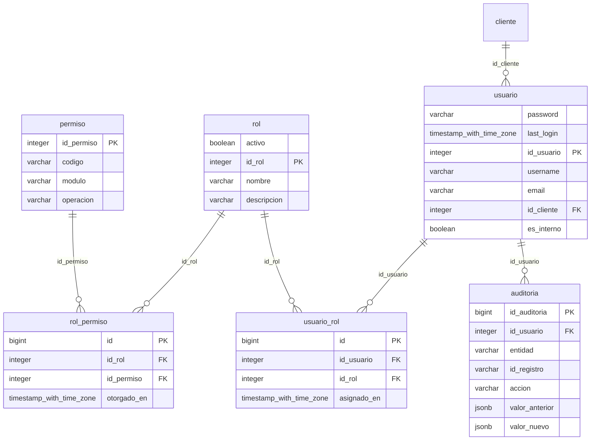
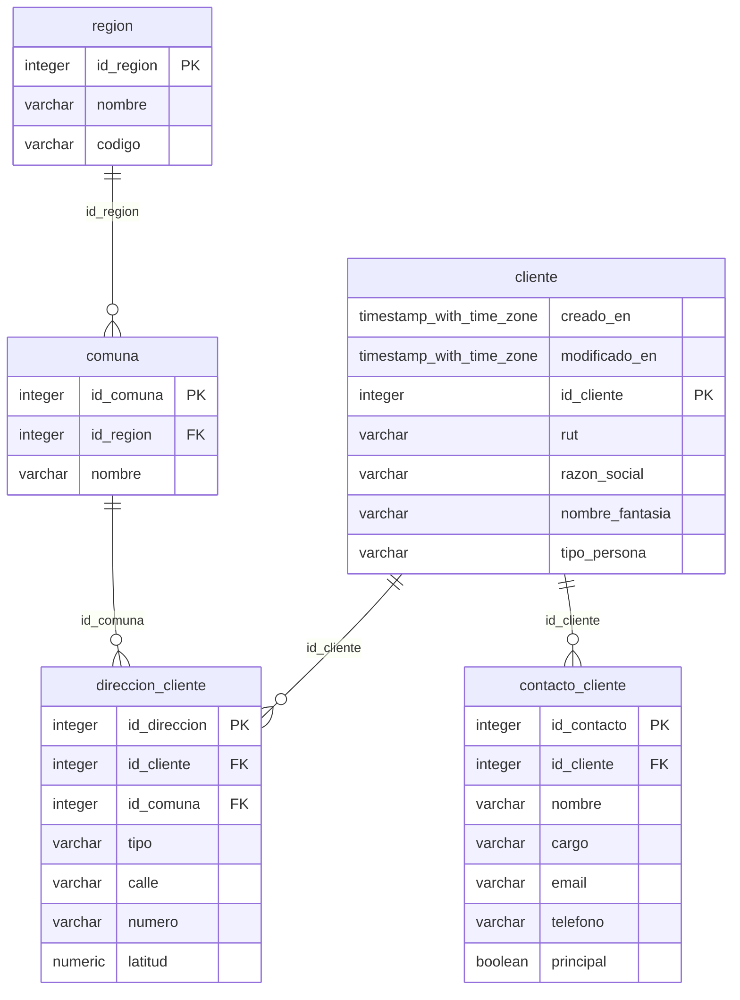
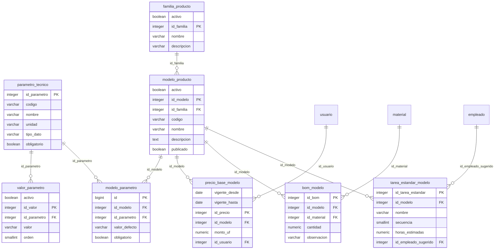
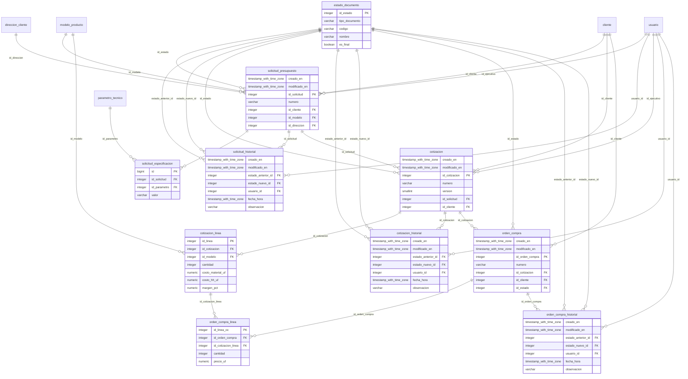
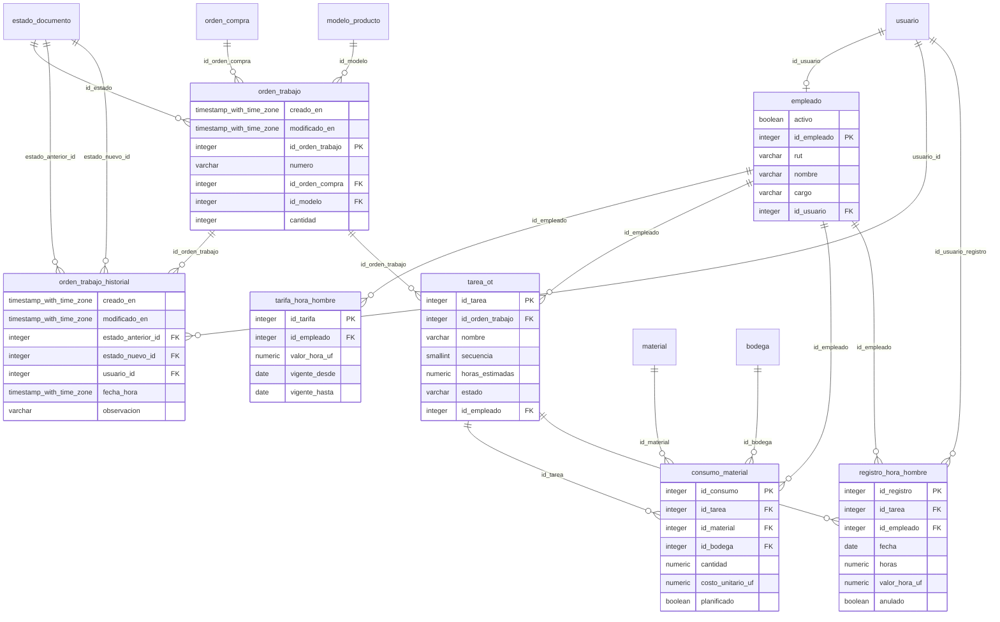
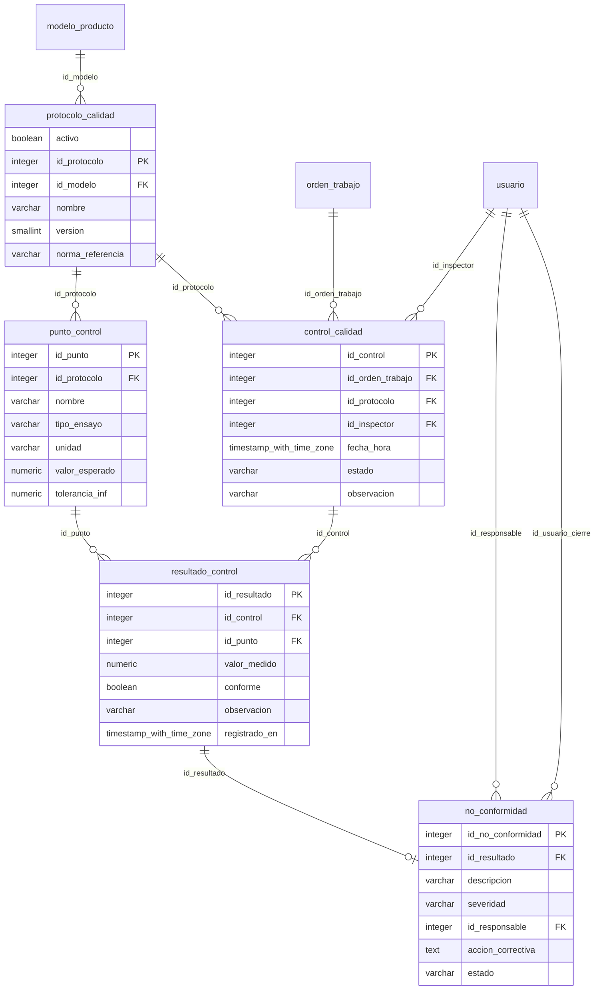
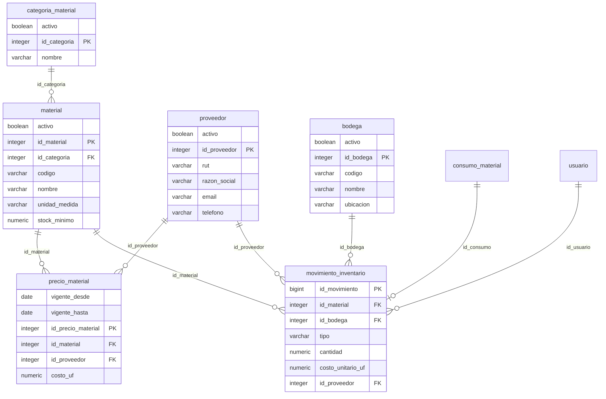
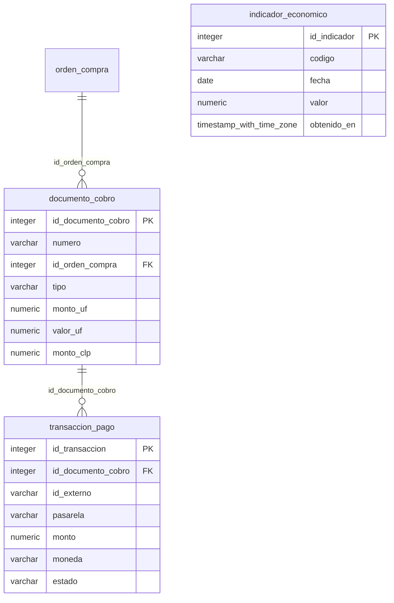
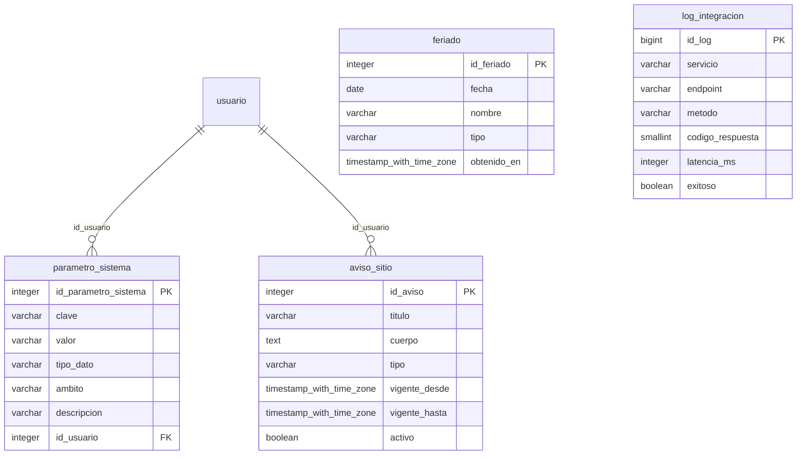

# Base de datos — SITRAFO

Base de datos **relacional PostgreSQL 16**, normalizada en **tercera forma normal (3FN)**, con **54 tablas** del modelo de negocio (requisito minimo: 30).

| Archivo | Contenido |
|---|---|
| `esquema_sitrafo.sql` | Script DDL: tablas, claves primarias y foraneas, indices y restricciones. |
| `datos_demo.sql` | Datos de demostracion (catalogo, clientes, documentos, produccion, calidad, inventario). |
| `diccionario_datos.md` | Cada tabla con sus columnas, tipos, claves, restricciones y descripcion. |
| `README.md` | Este documento: normalizacion, diagramas entidad-relacion y restauracion. |

## Composicion

| Modulo | Tablas |
|---|---|
| Seguridad y auditoria | 6 |
| Clientes | 5 |
| Catalogo y recetas | 8 |
| Proceso comercial | 10 |
| Produccion | 7 |
| Control de calidad | 5 |
| Inventario | 6 |
| Cobros, pagos e indicadores | 3 |
| Configuracion e integraciones | 4 |
| **Total modelo de negocio** | **54** |

El esquema incluye ademas 9 tablas tecnicas del framework (sesiones, tipos de contenido, migraciones, permisos internos de Django y revocacion de tokens JWT), que no forman parte del modelo de negocio y no se contabilizan.

## Normalizacion

- **1FN:** todos los atributos son atomicos; los valores multiples (parametros tecnicos de un modelo, lineas de una cotizacion, tareas de una orden) estan en tablas propias.
- **2FN:** cada tabla tiene clave primaria simple (`id_...`); ningun atributo depende de una parte de una clave compuesta. Las relaciones muchos a muchos se resuelven con tablas intermedias con clave propia y restriccion unica: `usuario_rol`, `rol_permiso`, `modelo_parametro`, `bom_modelo`.
- **3FN:** no hay dependencias transitivas. Los datos de referencia viven en su tabla y se referencian por clave foranea: `region`/`comuna`, `familia_producto`, `estado_documento`, `categoria_material`, `parametro_tecnico`/`valor_parametro`.
- **Historial separado:** cada documento del flujo tiene su tabla de historial de estados (`solicitud_historial`, `cotizacion_historial`, `orden_compra_historial`, `orden_trabajo_historial`).
- **Valores versionados por vigencia:** precios de modelos (`precio_base_modelo`), precios de materiales (`precio_material`) y tarifas de hora hombre (`tarifa_hora_hombre`) con vigencia desde y hasta: los documentos historicos conservan el valor que regia.
- **Sin datos derivados almacenados en duplicado:** el stock se calcula desde `movimiento_inventario`; la UF y el monto en pesos se congelan en cada documento (RN-03) por requerimiento de negocio, no por duplicacion.
- **Integridad declarada en la base:** claves foraneas en todas las relaciones (el borrado de registros referenciados lo impide ademas la aplicacion, para no perder historia), restricciones `UNIQUE` (RUT, numeros de documento, codigos) y `CHECK` (por ejemplo, horas y cantidades positivas).

## Diagramas entidad-relacion por modulo

GitHub dibuja estos diagramas automaticamente. Se muestran hasta siete columnas por tabla; el detalle completo esta en `diccionario_datos.md`. Las tablas sin columnas pertenecen a otro modulo y aparecen solo para mostrar la relacion.

### Seguridad y auditoria

Relacionado con: `cliente`.



### Clientes



### Catalogo y recetas

Relacionado con: `empleado`, `material`, `usuario`.



### Proceso comercial

Relacionado con: `cliente`, `direccion_cliente`, `modelo_producto`, `parametro_tecnico`, `usuario`.



### Produccion

Relacionado con: `bodega`, `estado_documento`, `material`, `modelo_producto`, `orden_compra`, `usuario`.



### Control de calidad

Relacionado con: `modelo_producto`, `orden_trabajo`, `usuario`.



### Inventario

Relacionado con: `consumo_material`, `usuario`.



### Cobros, pagos e indicadores

Relacionado con: `orden_compra`.



### Configuracion e integraciones

Relacionado con: `usuario`.



## Restaurar la base

Con PostgreSQL 16 y una base vacia:

```bash
psql -U <usuario> -d <base> -f esquema_sitrafo.sql
psql -U <usuario> -d <base> -f datos_demo.sql
```

Con el proyecto en Docker, la forma recomendada es crear el esquema con las migraciones del sistema, que generan exactamente este mismo DDL:

```bash
docker compose exec web python manage.py migrate
```

Los datos de demostracion no contienen informacion real: las cuentas personales tienen la clave deshabilitada, y se omitieron sesiones, tokens e historial del administrador.
